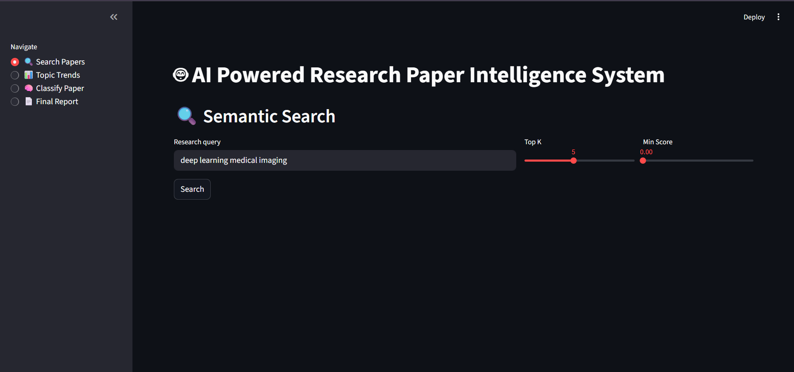
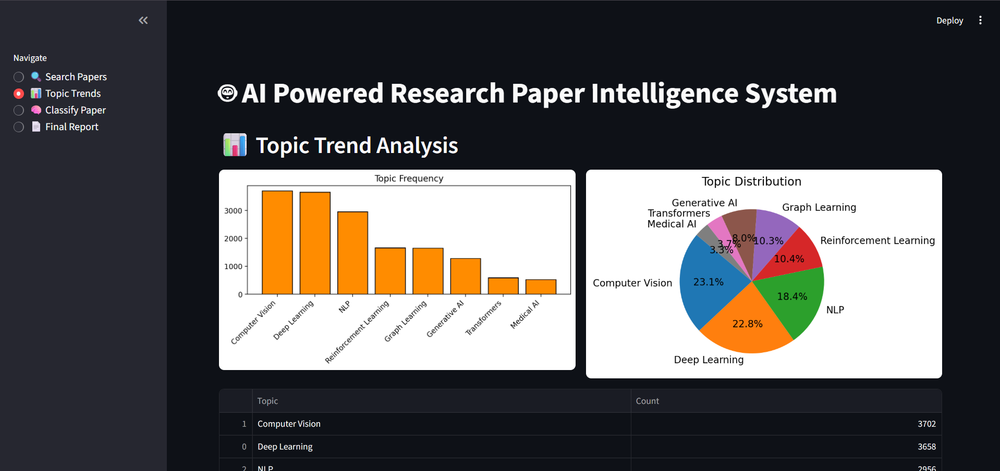
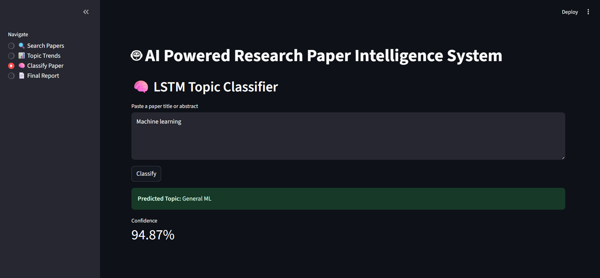
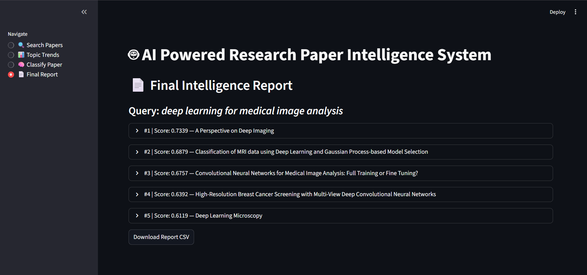

# 🤖 AI Powered Research Paper Intelligence System

An end-to-end AI system that automatically searches, summarizes, extracts keywords, identifies entities, classifies, and generates intelligent reports on ArXiv research papers — all through a Streamlit dashboard.

---

## 📌 What It Does

Instead of manually reading hundreds of papers, this system:
- Searches 2,000+ ArXiv ML papers using semantic similarity (FAISS)
- Summarizes abstracts using a T5 transformer model
- Extracts key phrases using KeyBERT
- Identifies people, organizations, and locations using spaCy NER
- Analyzes topic trends across the dataset
- Classifies papers into topics using a trained LSTM model
- Generates a final combined intelligence report

---

## 🏗️ Architecture

```
User Query
    │
    ▼
┌─────────────────┐
│  FAISS Search   │  ── Semantic similarity search over 2000 papers
└────────┬────────┘
         │
    ▼
┌─────────────────┐
│   Summarizer    │  ── T5-small transformer summarization
└────────┬────────┘
         │
    ▼
┌─────────────────┐
│ Keyword Finder  │  ── KeyBERT keyword & keyphrase extraction
└────────┬────────┘
         │
    ▼
┌─────────────────┐
│      NER        │  ── spaCy named entity recognition
└────────┬────────┘
         │
    ▼
┌─────────────────┐
│  Topic Trends   │  ── Frequency analysis & visualizations
└────────┬────────┘
         │
    ▼
┌─────────────────┐
│ LSTM Classifier │  ── Deep learning topic classification
└────────┬────────┘
         │
    ▼
┌─────────────────┐
│  Final Report   │  ── Combined JSON + CSV intelligence report
└─────────────────┘
```

---

## 📁 Project Structure

```
AI Powered Research Paper Intelligence System/
│
├── run_pipeline.py          # Run this first — builds all data files
├── app.py                   # Streamlit dashboard
├── ML-Arxiv-Papers.csv      # Raw dataset (optional local copy)
├── README.md
│
├── pipeline/                # Individual step scripts
│   ├── 01_eda_and_embeddings.py
│   ├── 02_searcher.py
│   ├── 03_summarizer.py
│   ├── 04_keyword_finder.py
│   ├── 05_ner.py
│   ├── 06_topic_trend_analysis.py
│   ├── 07_deep_learning_classifier.py
│   └── 08_genai.py
│
├── screenshots/             # Dashboard screenshots
│   ├── search_paper.png
│   ├── topic_trend.png
│   ├── classify_paper.png
│   └── final_paper.png
│
└── data/                    # Auto-generated after running pipeline
    ├── cleaned_papers.csv
    ├── arxiv_embeddings.npy
    ├── paper_faiss.index
    ├── search_results.json
    ├── summarized_results.json
    ├── keywords_results.json
    ├── ner_results.json
    ├── trend_report.csv
    ├── lstm_classifier.h5
    ├── tokenizer.pkl
    ├── label_encoder.pkl
    ├── cluster_names.json
    ├── classification_report.json
    ├── final_report.json
    └── final_report.csv
```

---

## 🛠️ Tech Stack

| Tool | Purpose |
|---|---|
| Hugging Face Datasets | ArXiv paper dataset |
| Sentence Transformers (`all-MiniLM-L6-v2`) | Text embeddings |
| FAISS | Fast vector similarity search |
| T5-small | Text summarization |
| KeyBERT | Keyword & keyphrase extraction |
| spaCy (`en_core_web_sm`) | Named Entity Recognition |
| TensorFlow / Keras | LSTM deep learning classifier |
| scikit-learn | Label encoding, train/test split |
| Streamlit | Interactive web dashboard |
| Pandas / NumPy | Data processing |
| Matplotlib | Visualizations |

---

## 🚀 How to Run

### Step 1 — Install dependencies
```bash
pip install datasets sentence-transformers faiss-cpu transformers keybert spacy tensorflow scikit-learn pandas numpy matplotlib streamlit
python -m spacy download en_core_web_sm
```

### Step 2 — Run the pipeline (one time only)
```bash
python run_pipeline.py
```
This will:
- Download 2,000 ArXiv papers
- Generate embeddings and build FAISS index
- Run summarization, keyword extraction, NER
- Train the LSTM classifier (3 epochs)
- Save all outputs to the `data/` folder

> ⏱️ Takes ~10-15 minutes on first run. Subsequent runs skip completed steps automatically.

### Step 3 — Launch the dashboard
```bash
streamlit run app.py --server.port 8502
```
Then open **http://localhost:8502** in your browser.

---

## 📊 Dashboard Pages

| Page | Description |
|---|---|
| 🔍 Search Papers | Enter any query, get top matching papers with summaries, keywords, NER, and topic prediction |
| 📊 Topic Trends | Bar chart and pie chart of topic distribution across the dataset |
| 🧠 Classify Paper | Paste any text and get an LSTM topic prediction with confidence score |
| 📄 Final Report | View and download the pre-generated intelligence report as CSV |

---

## 🖼️ Screenshots

### 🔍 Search Papers


### 📊 Topic Trends


### 🧠 Classify Paper


### 📄 Final Report


---

## 📈 Model Performance

| Model | Details |
|---|---|
| Embeddings | `all-MiniLM-L6-v2` — 384-dim sentence embeddings |
| Summarizer | `t5-small` — ~240MB, fast CPU inference |
| LSTM | Single LSTM (32 units), 3 epochs, ~70.7% validation accuracy (TF-IDF + KMeans labels) |
| NER | spaCy `en_core_web_sm` — detects PERSON, ORG, GPE, LOC |

---

## ⚡ System Requirements

| Spec | Minimum |
|---|---|
| RAM | 6GB |
| Storage | ~2GB (models + data) |
| Python | 3.9+ |
| GPU | Not required (CPU only) |

---

## 👨‍💻 Project Info

- Type: SIP Project
- Domain: AI / NLP / Deep Learning
- Dataset: [CShorten/ML-ArXiv-Papers](https://huggingface.co/datasets/CShorten/ML-ArXiv-Papers)
